# Neraca Lab - Database Schema (v1)

PostgreSQL 15+ (runs on `postgres:17-alpine` in Docker, database `neracalab`).

All tables and views live in the **`public`** schema. Objects are referenced without a schema
prefix (`company`, `income_statement`, ...), so any table can reference any other with a plain
foreign key.

| Script (`backend/src/main/resources/db/`) | Content                                                                          |
|-------------------------------------------|----------------------------------------------------------------------------------|
| `V1.0.1__schema.sql`                      | core tables: company, reporting periods, statements, corporate actions           |
| `V1.0.2__schema_market_valuation.sql`     | segments, daily prices, share counts, market / valuation snapshots, metrics      |
| `V1.0.3__views.sql`                       | 4 analysis views (dropped and recreated every start)                             |
| `V1.0.7__schema_ingestion.sql`            | ingestion bookkeeping: uploaded workbooks, job progress (section 4.8)            |
| `V1.0.8__schema_auth.sql`                 | users, roles, role permissions, user roles, login sessions (section 4.9)         |
| `V1.0.9__schema_ingestion_created_by.sql` | who started an ingestion job (`ingestion_job.created_by`), `app_migration` (section 4.8) |
| `V1.0.4__data_HRTA_financials.sql`        | HRTA statements and segments from the six IDX filings in `data/HRTA/xlsx`        |
| `V1.0.5__data_HRTA_market.sql`            | HRTA share counts (filings) and daily prices (`data/HRTA/price`)                 |
| `V1.0.6__data_metrics_valuation.sql`      | derived for all companies: market_snapshot, valuation_snapshot, financial_metric |

New filings can also be loaded at runtime through the upload endpoint, which writes the same
tables with the same rules (section 8 and [AI_INGESTION_DOCS.md](AI_INGESTION_DOCS.md)), and daily
prices through the price ingestion ([PRICE_INGESTION_DOCS.md](PRICE_INGESTION_DOCS.md)). The stored
data is read through the company APIs ([COMPANY_API_DOCS.md](COMPANY_API_DOCS.md)).

The scripts are executed by Spring SQL init (`spring.sql.init.*`) on every application start,
in the order listed in `application.yaml` (schema scripts V1.0.1-V1.0.3, V1.0.7, V1.0.8 and V1.0.9, then data scripts
V1.0.4-V1.0.6). No Flyway. Every statement is idempotent (`CREATE ... IF NOT EXISTS`,
`ON CONFLICT` upserts). Hibernate does not alter the schema (`ddl-auto: none`).
`V1.0.2` also drops the replaced v0 tables `revenue_segment` and `stock_price` if they exist.

---

## 1. Conventions

| Topic            | Rule                                                                                                                      |
|------------------|---------------------------------------------------------------------------------------------------------------------------|
| Amounts          | Full units of `company.currency` (no thousands / millions)                                                                |
| Income statement | Revenue and income positive, **expenses positive**. `income_tax` positive = expense, negative = benefit                   |
| Cash flow        | Signed as cash moves: inflow positive, **outflow negative** (`capital_expenditure`, `dividends_paid`, `debt_repaid`, ...) |
| `NULL` vs `0`    | `NULL` = not reported / not available, `0` = reported as zero                                                             |
| Ratios           | Fractions: `0.25` = 25%. Multiples (P/E, EV/OP, ...) are plain numbers ("x")                                              |
| IDX filings      | "Kuartal I / II / III" are year-to-date: stored as `Q1` / `H1` / `9M`; "Tahunan" = `FY`                                   |
| TTM              | Trailing twelve months = year-to-date + prior FY - prior-year same year-to-date                                           |
| Primary keys     | `BIGSERIAL` surrogate key                                                                                                 |
| Timestamps       | `created_at TIMESTAMPTZ DEFAULT now()` (and `updated_at` on `company`)                                                    |

---

## 2. Entity relationship diagram

```mermaid
erDiagram
    company ||--o{ reporting_period    : "has"
    company ||--o{ corporate_action    : "has"
    company ||--o{ segment             : "has"
    company ||--o{ price_daily         : "has"
    company ||--o{ share_snapshot      : "has"
    company ||--o{ market_snapshot     : "has"
    company ||--o{ valuation_snapshot  : "has"
    company ||--o{ financial_metric    : "has"

    reporting_period ||--o| income_statement    : "0..1 per period"
    reporting_period ||--o| balance_sheet       : "0..1 per period"
    reporting_period ||--o| cash_flow_statement : "0..1 per period"
    reporting_period ||--o{ segment_financial   : "per period"
    segment          ||--o{ segment_financial   : "per period"
    reporting_period ||--o{ financial_metric    : "based on"
    reporting_period ||--o{ valuation_snapshot  : "TTM basis"

    company {
        BIGSERIAL company_id PK
        VARCHAR ticker UK
        VARCHAR exchange UK
        CHAR currency
    }
    reporting_period {
        BIGSERIAL period_id PK
        BIGINT company_id FK
        INTEGER fiscal_year
        VARCHAR period_type
        DATE period_end
    }
    income_statement {
        BIGSERIAL income_statement_id PK
        BIGINT period_id FK
    }
    balance_sheet {
        BIGSERIAL balance_sheet_id PK
        BIGINT period_id FK
    }
    cash_flow_statement {
        BIGSERIAL cash_flow_id PK
        BIGINT period_id FK
    }
    segment {
        BIGSERIAL segment_id PK
        BIGINT company_id FK
        VARCHAR segment_type
        VARCHAR segment_name
    }
    segment_financial {
        BIGSERIAL segment_financial_id PK
        BIGINT segment_id FK
        BIGINT period_id FK
        NUMERIC revenue
    }
    corporate_action {
        BIGSERIAL corporate_action_id PK
        BIGINT company_id FK
        DATE action_date
        VARCHAR action_type
    }
    price_daily {
        BIGSERIAL price_id PK
        BIGINT company_id FK
        DATE trading_date
        NUMERIC close_price
    }
    share_snapshot {
        BIGSERIAL share_snapshot_id PK
        BIGINT company_id FK
        DATE snapshot_date
        NUMERIC shares_outstanding
    }
    market_snapshot {
        BIGSERIAL snapshot_id PK
        BIGINT company_id FK
        DATE snapshot_date
        NUMERIC market_cap
        NUMERIC enterprise_value
    }
    valuation_snapshot {
        BIGSERIAL valuation_id PK
        BIGINT company_id FK
        BIGINT period_id FK
        DATE valuation_date
        NUMERIC ev_op
    }
    financial_metric {
        BIGSERIAL metric_id PK
        BIGINT company_id FK
        BIGINT period_id FK
        DATE metric_date
        VARCHAR metric_name
        NUMERIC metric_value
    }
```



Data flow of the derived tables (filled by `V1.0.6` for all companies; after a price ingestion the
same formulas run for that one company, see [PRICE_INGESTION_DOCS.md](PRICE_INGESTION_DOCS.md) section 2):

```text
income_statement / balance_sheet / cash_flow_statement ──► v_key_metrics, v_ttm_financials
price_daily + share_snapshot + latest balance sheet     ──► market_snapshot      (daily)
v_ttm_financials + price_daily + share_snapshot          ──► valuation_snapshot   (period ends + latest day)
v_key_metrics + valuation_snapshot                       ──► financial_metric     (long format)
```

**Company consistency:** child tables that carry both `company_id` and `period_id`
(`income_statement`, `balance_sheet`, `cash_flow_statement`, `segment_financial`,
`financial_metric`, `valuation_snapshot`) have a composite foreign key
`(period_id, company_id) → reporting_period (period_id, company_id)`, and `segment_financial`
also has `(segment_id, company_id) → segment (segment_id, company_id)`. A row can therefore
never point to a period or segment of another company.

---

## 3. Core tables (`V1.0.1__schema.sql`)

### 3.1 `company`

Listed company master data. Exactly one row per `(ticker, exchange)`: the unique constraint
plus the two format checks (upper case, no blanks) make a second row for the same company
impossible, also for `hrta` or `" HRTA"`. The AI ingestion registers a company with
`INSERT ... ON CONFLICT ON CONSTRAINT uq_company_ticker_exchange DO UPDATE`, so concurrent
uploads of the same company update the one row instead of inserting a second.

| Column            | Type           | Null | Default | Description                                                           |
|-------------------|----------------|------|---------|-----------------------------------------------------------------------|
| `company_id`      | `BIGSERIAL`    | no   | serial  | PK                                                                    |
| `ticker`          | `VARCHAR(20)`  | no   |         | Stock ticker, upper case, e.g. `HRTA`                                 |
| `exchange`        | `VARCHAR(50)`  | no   |         | Exchange code, upper case, e.g. `IDX`                                 |
| `cik`             | `VARCHAR(20)`  | yes  |         | SEC Central Index Key (US filers only)                                |
| `company_name`    | `VARCHAR(255)` | no   |         | Display name                                                          |
| `legal_name`      | `VARCHAR(255)` | yes  |         | Full legal name                                                       |
| `industry`        | `VARCHAR(150)` | yes  |         |                                                                       |
| `sector`          | `VARCHAR(150)` | yes  |         |                                                                       |
| `country`         | `VARCHAR(100)` | yes  |         |                                                                       |
| `currency`        | `CHAR(3)`      | yes  |         | ISO 4217 reporting currency of the financial statements               |
| `fiscal_year_end` | `DATE`         | yes  |         | Most recent fiscal year end; its month/day define the fiscal calendar |
| `ipo_date`        | `DATE`         | yes  |         |                                                                       |
| `active`          | `BOOLEAN`      | no   | `TRUE`  |                                                                       |
| `created_at`      | `TIMESTAMPTZ`  | no   | `now()` |                                                                       |
| `updated_at`      | `TIMESTAMPTZ`  | no   | `now()` |                                                                       |

| Constraint                   | Definition                                     |
|------------------------------|------------------------------------------------|
| `uq_company_ticker_exchange` | `UNIQUE NULLS NOT DISTINCT (ticker, exchange)` |
| `ck_company_ticker`          | `ticker ~ '^[A-Z0-9][A-Z0-9.-]*$'`             |
| `ck_company_exchange`        | `exchange ~ '^[A-Z][A-Z0-9]*$'`                |
| `ck_company_currency`        | `currency IS NULL OR currency ~ '^[A-Z]{3}$'`  |

### 3.2 `reporting_period`

One row per company per reported period.

| Column           | Type           | Null | Default | Description                                           |
|------------------|----------------|------|---------|-------------------------------------------------------|
| `period_id`      | `BIGSERIAL`    | no   | serial  | PK                                                    |
| `company_id`     | `BIGINT`       | no   |         | FK → `company`                                        |
| `fiscal_year`    | `INTEGER`      | no   |         |                                                       |
| `fiscal_quarter` | `SMALLINT`     | yes  |         | Quarter in which the period ends (1-4); `NULL` for FY |
| `period_type`    | `VARCHAR(20)`  | no   |         | See below                                             |
| `period_start`   | `DATE`         | yes  |         |                                                       |
| `period_end`     | `DATE`         | no   |         |                                                       |
| `filing_date`    | `DATE`         | yes  |         |                                                       |
| `source_filing`  | `VARCHAR(100)` | yes  |         | Source document, e.g. the IDX XBRL workbook file name |
| `audited`        | `BOOLEAN`      | yes  |         | `TRUE` audited, `FALSE` unaudited, `NULL` unknown     |
| `created_at`     | `TIMESTAMPTZ`  | no   | `now()` |                                                       |

| `period_type` | Meaning                                           |
|---------------|---------------------------------------------------|
| `FY`          | Full fiscal year                                  |
| `Q1`..`Q4`    | Single 3-month quarter (`Q1` is also 3-month YTD) |
| `H1`          | 6-month year-to-date                              |
| `9M`          | 9-month year-to-date                              |
| `TTM`         | Trailing twelve months                            |

| Constraint / index                | Definition                                                                         |
|-----------------------------------|------------------------------------------------------------------------------------|
| `uq_reporting_period`             | `UNIQUE NULLS NOT DISTINCT (company_id, fiscal_year, fiscal_quarter, period_type)` |
| `uq_reporting_period_company`     | `UNIQUE (period_id, company_id)` - target of the composite FKs                     |
| `ck_reporting_period_type`        | `period_type IN ('FY','Q1','Q2','Q3','Q4','H1','9M','TTM')`                        |
| `ck_reporting_period_quarter`     | `fiscal_quarter IS NULL OR fiscal_quarter BETWEEN 1 AND 4`                         |
| `ck_reporting_period_dates`       | `period_start IS NULL OR period_start <= period_end`                               |
| `ix_reporting_period_company_end` | index on `(company_id, period_end)`                                                |

### 3.3 `income_statement`

At most one row per period. All amounts `NUMERIC(24,4)` unless stated.

| Column                 | Type              | Description                                                          |
|------------------------|-------------------|----------------------------------------------------------------------|
| `income_statement_id`  | `BIGSERIAL`       | PK                                                                   |
| `company_id`           | `BIGINT` not null | FK → `company`                                                       |
| `period_id`            | `BIGINT` not null | FK → `reporting_period`                                              |
| `revenue`              |                   |                                                                      |
| `cost_of_revenue`      |                   | Positive                                                             |
| `gross_profit`         |                   |                                                                      |
| `operating_expenses`   |                   | All operating expenses below gross profit (selling, G&A, R&D, other) |
| `sga_expense`          |                   | Selling, general & administrative                                    |
| `rd_expense`           |                   | Research & development                                               |
| `depreciation`         |                   | Depreciation of PP&E plus right-of-use assets                        |
| `amortization`         |                   | Amortization of intangibles                                          |
| `operating_income`     |                   | Operating profit (the "OP" of EV/OP)                                 |
| `ebit`                 |                   |                                                                      |
| `ebitda`               |                   |                                                                      |
| `interest_income`      |                   |                                                                      |
| `interest_expense`     |                   | Positive                                                             |
| `pretax_income`        |                   |                                                                      |
| `income_tax`           |                   | Positive = tax expense, negative = tax benefit                       |
| `net_income`           |                   | Profit for the period, including non-controlling interests           |
| `net_income_to_parent` |                   | Profit attributable to owners of the parent (EPS numerator)          |
| `basic_eps`            | `NUMERIC(20,8)`   |                                                                      |
| `diluted_eps`          | `NUMERIC(20,8)`   |                                                                      |
| `basic_shares`         | `NUMERIC(24,8)`   | Weighted average shares used for basic EPS                           |
| `diluted_shares`       | `NUMERIC(24,8)`   |                                                                      |
| `created_at`           | `TIMESTAMPTZ`     | Default `now()`                                                      |

Constraints: `uq_income_statement UNIQUE (company_id, period_id)`,
`fk_income_statement_period_company (period_id, company_id) → reporting_period`.

### 3.4 `balance_sheet`

Statement of financial position at `reporting_period.period_end`. All amounts `NUMERIC(24,4)` unless stated.

| Column                     | Type              | Description                                                                                     |
|----------------------------|-------------------|-------------------------------------------------------------------------------------------------|
| `balance_sheet_id`         | `BIGSERIAL`       | PK                                                                                              |
| `company_id`               | `BIGINT` not null | FK → `company`                                                                                  |
| `period_id`                | `BIGINT` not null | FK → `reporting_period`                                                                         |
| `cash_and_equivalents`     |                   |                                                                                                 |
| `marketable_securities`    |                   |                                                                                                 |
| `accounts_receivable`      |                   |                                                                                                 |
| `inventory`                |                   |                                                                                                 |
| `current_assets`           |                   |                                                                                                 |
| `total_assets`             |                   |                                                                                                 |
| `accounts_payable`         |                   |                                                                                                 |
| `deferred_revenue`         |                   | Contract liabilities / advances received from customers                                         |
| `current_liabilities`      |                   |                                                                                                 |
| `total_liabilities`        |                   |                                                                                                 |
| `short_term_debt`          |                   | Interest-bearing debt due within 12 months (incl. current maturities), excl. leases             |
| `long_term_debt`           |                   | Interest-bearing debt due after 12 months (bank loans, bonds, financing payables), excl. leases |
| `lease_liabilities`        |                   | Current + non-current lease liabilities                                                         |
| `shareholders_equity`      |                   | Equity attributable to owners of the parent                                                     |
| `non_controlling_interest` |                   |                                                                                                 |
| `total_equity`             |                   | `shareholders_equity + non_controlling_interest`                                                |
| `retained_earnings`        |                   | Appropriated + unappropriated retained earnings                                                 |
| `goodwill`                 |                   |                                                                                                 |
| `intangible_assets`        |                   |                                                                                                 |
| `shares_outstanding`       | `NUMERIC(24,8)`   | Issued shares less treasury shares at period end                                                |
| `created_at`               | `TIMESTAMPTZ`     | Default `now()`                                                                                 |

Constraints: `uq_balance_sheet UNIQUE (company_id, period_id)`,
`fk_balance_sheet_period_company (period_id, company_id) → reporting_period`.

### 3.5 `cash_flow_statement`

Signed as cash moves: inflow positive, outflow negative. All amounts `NUMERIC(24,4)` unless stated.

| Column                | Type              | Description                                                                     |
|-----------------------|-------------------|---------------------------------------------------------------------------------|
| `cash_flow_id`        | `BIGSERIAL`       | PK                                                                              |
| `company_id`          | `BIGINT` not null | FK → `company`                                                                  |
| `period_id`           | `BIGINT` not null | FK → `reporting_period`                                                         |
| `operating_cash_flow` |                   |                                                                                 |
| `capital_expenditure` |                   | Purchases of PP&E and intangibles incl. advances for PP&E (negative)            |
| `investing_cash_flow` |                   |                                                                                 |
| `financing_cash_flow` |                   |                                                                                 |
| `acquisitions`        |                   | (negative)                                                                      |
| `share_buybacks`      |                   | (negative)                                                                      |
| `stock_issuance`      |                   | (positive)                                                                      |
| `dividends_paid`      |                   | (negative)                                                                      |
| `debt_issued`         |                   | Proceeds from bank loans, bonds and financing payables (positive)               |
| `debt_repaid`         |                   | Repayments of bank loans, bonds and financing payables (negative), excl. leases |
| `lease_payments`      |                   | Principal payments of lease liabilities (negative)                              |
| `cash_change`         |                   | Net change in cash                                                              |
| `ending_cash`         |                   | Cash at end of period                                                           |
| `created_at`          | `TIMESTAMPTZ`     | Default `now()`                                                                 |

Constraints: `uq_cash_flow_statement UNIQUE (company_id, period_id)`,
`fk_cash_flow_statement_period_company (period_id, company_id) → reporting_period`.

### 3.6 `corporate_action`

Splits, rights issues, dividends, buybacks and other events that change the share count or capital.

| Column                | Type                   | Description                                                 |
|-----------------------|------------------------|-------------------------------------------------------------|
| `corporate_action_id` | `BIGSERIAL`            | PK                                                          |
| `company_id`          | `BIGINT` not null      | FK → `company`                                              |
| `action_date`         | `DATE` not null        |                                                             |
| `action_type`         | `VARCHAR(50)` not null | See constraint below                                        |
| `ratio_from`          | `NUMERIC(20,8)`        | Old shares in a split / rights ratio, e.g. 1 in a 1:5 split |
| `ratio_to`            | `NUMERIC(20,8)`        | New shares in a split / rights ratio, e.g. 5 in a 1:5 split |
| `shares_issued`       | `NUMERIC(24,8)`        |                                                             |
| `cash_raised`         | `NUMERIC(28,4)`        |                                                             |
| `description`         | `TEXT`                 |                                                             |
| `created_at`          | `TIMESTAMPTZ` not null | Default `now()`                                             |

`ck_corporate_action_type`: `IPO`, `STOCK_SPLIT`, `REVERSE_SPLIT`, `STOCK_DIVIDEND`,
`BONUS_SHARES`, `RIGHTS_ISSUE`, `PRIVATE_PLACEMENT`, `SHARE_BUYBACK`, `CASH_DIVIDEND`,
`BOND_ISSUANCE`, `MERGER`, `ACQUISITION`, `SPIN_OFF`, `DELISTING`, `OTHER`.
Index `ix_corporate_action_company_date (company_id, action_date)`.

---

## 4. Segment, market and valuation tables (`V1.0.2__schema_market_valuation.sql`)

### 4.1 `segment`

Reportable segments / revenue lines of a company, as named in the filings.

| Column            | Type           | Null | Description                                            |
|-------------------|----------------|------|--------------------------------------------------------|
| `segment_id`      | `BIGSERIAL`    | no   | PK                                                     |
| `company_id`      | `BIGINT`       | no   | FK → `company`                                         |
| `segment_type`    | `VARCHAR(20)`  | no   | `PRODUCT`, `SERVICE`, `GEOGRAPHY`, `CUSTOMER`, `OTHER` |
| `segment_name`    | `VARCHAR(255)` | no   | Name as written in the filing (original language)      |
| `segment_name_en` | `VARCHAR(255)` | yes  | English translation                                    |
| `description`     | `TEXT`         | yes  |                                                        |
| `active`          | `BOOLEAN`      | no   | Default `TRUE`                                         |
| `created_at`      | `TIMESTAMPTZ`  | no   | Default `now()`                                        |

Constraints: `uq_segment UNIQUE (company_id, segment_type, segment_name)`,
`uq_segment_company UNIQUE (segment_id, company_id)` (composite FK target), `ck_segment_type`.

### 4.2 `segment_financial`

Figures per segment per reporting period. Revenue rows of one period sum to
`income_statement.revenue`.

| Column                 | Type            | Null | Description                                           |
|------------------------|-----------------|------|-------------------------------------------------------|
| `segment_financial_id` | `BIGSERIAL`     | no   | PK                                                    |
| `segment_id`           | `BIGINT`        | no   | FK → `segment`                                        |
| `company_id`           | `BIGINT`        | no   | FK → `company`                                        |
| `period_id`            | `BIGINT`        | no   | FK → `reporting_period`                               |
| `revenue`              | `NUMERIC(24,4)` | yes  | Segment revenue                                       |
| `cost_of_revenue`      | `NUMERIC(24,4)` | yes  | When disclosed                                        |
| `gross_profit`         | `NUMERIC(24,4)` | yes  | When disclosed                                        |
| `operating_income`     | `NUMERIC(24,4)` | yes  | Segment result, when operating segments are disclosed |
| `total_assets`         | `NUMERIC(24,4)` | yes  | When disclosed                                        |
| `created_at`           | `TIMESTAMPTZ`   | no   | Default `now()`                                       |

Constraints: `uq_segment_financial UNIQUE (segment_id, period_id)`,
`fk_segment_financial_segment_company (segment_id, company_id) → segment`,
`fk_segment_financial_period_company (period_id, company_id) → reporting_period`.
Index `ix_segment_financial_period (period_id)`.

### 4.3 `price_daily`

Daily prices in `company.currency`, one row per trading day.

| Column           | Type            | Null | Description                                             |
|------------------|-----------------|------|---------------------------------------------------------|
| `price_id`       | `BIGSERIAL`     | no   | PK                                                      |
| `company_id`     | `BIGINT`        | no   | FK → `company`                                          |
| `trading_date`   | `DATE`          | no   |                                                         |
| `open_price`     | `NUMERIC(20,8)` | yes  |                                                         |
| `high_price`     | `NUMERIC(20,8)` | yes  |                                                         |
| `low_price`      | `NUMERIC(20,8)` | yes  |                                                         |
| `close_price`    | `NUMERIC(20,8)` | yes  |                                                         |
| `adjusted_close` | `NUMERIC(20,8)` | yes  | Close adjusted for splits and cash dividends (provider) |
| `volume`         | `BIGINT`        | yes  | Traded volume in shares                                 |
| `created_at`     | `TIMESTAMPTZ`   | no   | Default `now()`                                         |

Constraints: `uq_price_daily UNIQUE (company_id, trading_date)`, `ck_price_daily_positive`
(`close_price > 0`), `ck_price_daily_range` (`high_price >= low_price`), `ck_price_daily_volume`
(`volume >= 0`).

Filled by the seed scripts (HRTA) and by the price ingestion
(`POST /api/v1/prices/ingestions`, [PRICE_INGESTION_DOCS.md](PRICE_INGESTION_DOCS.md)): trading days
only, no holiday placeholders, no unfinished intraday bar; prices rounded to 4 decimals.

### 4.4 `share_snapshot`

Share counts at a date.

| Column               | Type            | Null | Description                                                     |
|----------------------|-----------------|------|-----------------------------------------------------------------|
| `share_snapshot_id`  | `BIGSERIAL`     | no   | PK                                                              |
| `company_id`         | `BIGINT`        | no   | FK → `company`                                                  |
| `snapshot_date`      | `DATE`          | no   |                                                                 |
| `basic_shares`       | `NUMERIC(24,8)` | yes  | Weighted average shares for basic EPS of the period ending here |
| `diluted_shares`     | `NUMERIC(24,8)` | yes  |                                                                 |
| `shares_outstanding` | `NUMERIC(24,8)` | yes  | Issued shares less treasury shares; used for market cap         |
| `public_float`       | `NUMERIC(24,8)` | yes  | Shares held by the public                                       |
| `treasury_shares`    | `NUMERIC(24,8)` | yes  |                                                                 |
| `created_at`         | `TIMESTAMPTZ`   | no   | Default `now()`                                                 |

Constraint: `uq_share_snapshot UNIQUE (company_id, snapshot_date)`.

### 4.5 `market_snapshot` (derived)

Market value per trading day.

| Column               | Type            | Null | Description                                                                                                                                                                            |
|----------------------|-----------------|------|----------------------------------------------------------------------------------------------------------------------------------------------------------------------------------------|
| `snapshot_id`        | `BIGSERIAL`     | no   | PK                                                                                                                                                                                     |
| `company_id`         | `BIGINT`        | no   | FK → `company`                                                                                                                                                                         |
| `snapshot_date`      | `DATE`          | no   | Trading day                                                                                                                                                                            |
| `share_price`        | `NUMERIC(20,8)` | yes  | `price_daily.close_price`                                                                                                                                                              |
| `shares_outstanding` | `NUMERIC(24,8)` | yes  | Latest `share_snapshot` on or before the date                                                                                                                                          |
| `market_cap`         | `NUMERIC(28,4)` | yes  | `share_price × shares_outstanding`                                                                                                                                                     |
| `enterprise_value`   | `NUMERIC(28,4)` | yes  | `market_cap + total_debt - cash_and_investments + non_controlling_interest` of the latest balance sheet with `period_end` on or before the date; `NULL` before the first balance sheet |
| `created_at`         | `TIMESTAMPTZ`   | no   | Default `now()`                                                                                                                                                                        |

Constraint: `uq_market_snapshot UNIQUE (company_id, snapshot_date)`.

### 4.6 `valuation_snapshot` (derived)

Price against trailing-twelve-month (TTM) fundamentals. One row per period end that has TTM
figures, plus the latest trading day. Price = last close on or before `valuation_date`;
fundamentals = latest period ended on or before it with TTM revenue and a balance sheet.
Every price ingestion adds the new latest trading day and keeps the earlier "latest day" rows, so
daily ingestion builds a valuation history; it also recalculates those earlier rows when prices
are corrected.

| Column                 | Type            | Formula / description                                                       |
|------------------------|-----------------|-----------------------------------------------------------------------------|
| `valuation_id`         | `BIGSERIAL`     | PK                                                                          |
| `company_id`           | `BIGINT`        | FK → `company`                                                              |
| `period_id`            | `BIGINT`        | FK → `reporting_period`: period of the TTM figures and balance sheet        |
| `valuation_date`       | `DATE` not null |                                                                             |
| `share_price`          | `NUMERIC(20,8)` | last close on or before `valuation_date`                                    |
| `market_cap`           | `NUMERIC(28,4)` | `share_price × shares_outstanding`                                          |
| `enterprise_value`     | `NUMERIC(28,4)` | `market_cap + total_debt - cash_and_investments + non_controlling_interest` |
| `eps_ttm`              | `NUMERIC(20,8)` | `net_income_to_parent_ttm / shares_outstanding`                             |
| `revenue_ttm`          | `NUMERIC(28,4)` |                                                                             |
| `ebitda_ttm`           | `NUMERIC(28,4)` |                                                                             |
| `operating_income_ttm` | `NUMERIC(28,4)` | TTM operating profit                                                        |
| `fcf_ttm`              | `NUMERIC(28,4)` | `operating_cash_flow_ttm + capital_expenditure_ttm`                         |
| `book_value`           | `NUMERIC(28,4)` | `shareholders_equity` (attributable to the parent)                          |
| `pe_ratio`             | `NUMERIC(20,8)` | `share_price / eps_ttm`                                                     |
| `ps_ratio`             | `NUMERIC(20,8)` | `market_cap / revenue_ttm`                                                  |
| `pb_ratio`             | `NUMERIC(20,8)` | `market_cap / book_value`                                                   |
| `ev_ebitda`            | `NUMERIC(20,8)` | `enterprise_value / ebitda_ttm`                                             |
| `ev_sales`             | `NUMERIC(20,8)` | `enterprise_value / revenue_ttm`                                            |
| `ev_op`                | `NUMERIC(20,8)` | **EV / operating profit** = `enterprise_value / operating_income_ttm`       |
| `fcf_yield`            | `NUMERIC(20,8)` | `fcf_ttm / market_cap`                                                      |
| `earnings_yield`       | `NUMERIC(20,8)` | `eps_ttm / share_price` (inverse of P/E)                                    |
| `created_at`           | `TIMESTAMPTZ`   | Default `now()`                                                             |

Constraints: `uq_valuation_snapshot UNIQUE (company_id, valuation_date)`,
`fk_valuation_snapshot_period_company (period_id, company_id) → reporting_period`.

### 4.7 `financial_metric` (derived)

Every calculated metric in long format: one row per company, period / date and metric.

| Column                | Type             | Null | Description                                                                                                    |
|-----------------------|------------------|------|----------------------------------------------------------------------------------------------------------------|
| `metric_id`           | `BIGSERIAL`      | no   | PK                                                                                                             |
| `company_id`          | `BIGINT`         | no   | FK → `company`                                                                                                 |
| `period_id`           | `BIGINT`         | yes  | FK → `reporting_period` (for valuation metrics: the TTM basis period)                                          |
| `metric_date`         | `DATE`           | yes  | Period end (fundamentals) or valuation date (valuation metrics)                                                |
| `metric_name`         | `VARCHAR(100)`   | no   | e.g. `gross_margin`, `roe_annualized`, `ev_op`                                                                 |
| `metric_category`     | `VARCHAR(50)`    | yes  | `PROFITABILITY`, `LIQUIDITY`, `LEVERAGE`, `EFFICIENCY`, `CASH_FLOW`, `BALANCE_SHEET`, `PER_SHARE`, `VALUATION` |
| `metric_value`        | `NUMERIC(28,10)` | yes  |                                                                                                                |
| `unit`                | `VARCHAR(30)`    | yes  | `ratio` (fraction), `x` (multiple), `days`, `IDR`, `IDR/share`                                                 |
| `calculation_formula` | `TEXT`           | yes  | Human-readable formula                                                                                         |
| `source`              | `VARCHAR(100)`   | yes  | `v_key_metrics` or `valuation_snapshot`                                                                        |
| `created_at`          | `TIMESTAMPTZ`    | yes  | Default `now()`                                                                                                |

Constraints: `uq_financial_metric UNIQUE NULLS NOT DISTINCT (company_id, period_id, metric_date, metric_name)`,
`fk_financial_metric_period_company`, `ck_financial_metric_anchor` (`period_id` or `metric_date`
set). Index `ix_financial_metric_name_date (company_id, metric_name, metric_date)`.

| Category        | Metrics (`metric_name`)                                                                                                                                             |
|-----------------|---------------------------------------------------------------------------------------------------------------------------------------------------------------------|
| `PROFITABILITY` | `gross_margin`, `operating_margin`, `ebitda_margin`, `net_margin`, `effective_tax_rate`, `interest_coverage`, `roe_annualized`, `roa_annualized`, `roic_annualized` |
| `LIQUIDITY`     | `current_ratio`, `quick_ratio`, `cash_ratio`                                                                                                                        |
| `LEVERAGE`      | `debt_to_equity`, `net_debt_to_equity`, `liabilities_to_equity`, `equity_to_assets`, `net_debt_to_ebitda_annualized`                                                |
| `EFFICIENCY`    | `inventory_days`, `receivable_days`, `payable_days`, `cash_conversion_cycle_days`                                                                                   |
| `CASH_FLOW`     | `free_cash_flow`, `fcf_after_leases`, `fcf_margin`, `ocf_to_net_income`, `capex_to_revenue`                                                                         |
| `BALANCE_SHEET` | `net_debt`, `working_capital`, `tangible_book_value`, `ncav`                                                                                                        |
| `PER_SHARE`     | `eps`, `book_value_per_share`, `tangible_book_per_share`, `ncav_per_share`, `net_cash_per_share`, `fcf_per_share`                                                   |
| `VALUATION`     | `market_cap`, `enterprise_value`, `eps_ttm`, `pe_ratio`, `ps_ratio`, `pb_ratio`, `ev_ebitda`, `ev_sales`, **`ev_op`**, `fcf_yield`, `earnings_yield`                |

Metrics whose value cannot be calculated (missing input) are not stored.

---

### 4.8 `ingestion_file` and `ingestion_job` (`V1.0.7__schema_ingestion.sql`)

Bookkeeping of the ingestions; no other table references them. Full description:
[INGESTION_JOBS_DOCS.md](INGESTION_JOBS_DOCS.md).

| Table            | Column                         | Type         | Notes                                                                           |
|------------------|--------------------------------|--------------|---------------------------------------------------------------------------------|
| `ingestion_file` | `file_id`                      | BIGSERIAL PK |                                                                                 |
|                  | `file_name`                    | VARCHAR(255) | name of the first upload of this content                                        |
|                  | `content_type`                 | VARCHAR(255) | as sent by the client                                                           |
|                  | `size_bytes`                   | BIGINT       | `> 0` and `= octet_length(content)` (check)                                     |
|                  | `checksum_sha256`              | CHAR(64)     | lower-case hex, **unique**: one row per content                                 |
|                  | `content`                      | BYTEA        | the workbook bytes                                                              |
| `ingestion_job`  | `job_id`                       | UUID PK      |                                                                                 |
|                  | `job_type`                     | VARCHAR(30)  | `FINANCIAL_STATEMENT`, `PRICE`                                                  |
|                  | `status`                       | VARCHAR(30)  | `QUEUED`, `RUNNING`, `WAITING_RATE_LIMIT`, `SUCCEEDED`, `INCOMPLETE`, `FAILED`  |
|                  | `stage`                        | VARCHAR(500) | current step, or summary of a finished job                                      |
|                  | `exchange`, `ticker`           | VARCHAR      | company of the job (upload: once the workbook is read)                          |
|                  | `file_id`                      | BIGINT FK    | `ingestion_file`; required for `FINANCIAL_STATEMENT` (check)                    |
|                  | `file_name`, `file_reused`     |              | name of this upload; TRUE when the stored file was reused                       |
|                  | `full_history`                 | BOOLEAN      | price jobs                                                                      |
|                  | `attempts`, `message`, `result`|              | runs, failure / wait reason, JSONB result                                       |
|                  | `requested_at` ... `updated_at`| TIMESTAMPTZ  | `requested_at`, `started_at`, `finished_at`, `resume_at`, `updated_at`          |
|                  | `created_by`                   | BIGINT FK    | `users`, `ON DELETE SET NULL`: who started the job; NULL = scheduled run or deleted user (V1.0.9) |
|                  | `created_by_username`          | VARCHAR(50)  | the username at that time, kept after the user is deleted (V1.0.9)              |
| `app_migration`  | `name` (PK), `applied_at`, `details` |        | one-time data migrations done by the backend, e.g. attributing jobs recorded before V1.0.9 to the root user (V1.0.9) |

Indexes: `ix_ingestion_job_requested` (`requested_at DESC`), `ix_ingestion_job_file`,
`ix_ingestion_job_active` (partial, active statuses), `ix_ingestion_job_created_by`.

### 4.9 Users, roles and sessions (`V1.0.8__schema_auth.sql`)

Login and access control; no business table references them. The root user and the built-in
Administrator role are created by the backend at startup (`AuthBootstrap`), so the password is
hashed with BCrypt. Rules and APIs: [AUTH_DOCS.md](AUTH_DOCS.md).

| Table              | Column                                   | Type          | Notes                                                                 |
|--------------------|------------------------------------------|---------------|-----------------------------------------------------------------------|
| `users`            | `user_id`                                | BIGSERIAL PK  |                                                                       |
|                    | `username`                               | VARCHAR(50)   | **unique** (`uq_users_username`), lower case `[a-z0-9._-]{3,50}` (check) |
|                    | `email`                                  | VARCHAR(255)  | **unique** (`uq_users_email`), lower case (check)                     |
|                    | `password_hash`                          | VARCHAR(100)  | BCrypt                                                                |
|                    | `full_name`, `address`, `phone`, `dob`   |               | profile; `dob` after 1900-01-01                                       |
|                    | `avatar`, `avatar_content_type`, `avatar_updated_at` | BYTEA, ... | profile picture (both or neither, check)                         |
|                    | `active`                                 | BOOLEAN       | a deactivated user cannot log in                                      |
|                    | `root`                                   | BOOLEAN       | the root user `admin`; at most one (`uq_users_root`)                  |
| `roles`            | `role_id`, `name`, `description`         |               | name unique ignoring case (`uq_roles_name` on `lower(name)`)          |
|                    | `system`                                 | BOOLEAN       | the built-in Administrator role; at most one (`uq_roles_system`)      |
| `role_permissions` | `role_id` (FK, cascade), `permission`    |               | PK `(role_id, permission)`; `ADMIN`, `INGESTION`, `COMPANIES` (check)  |
| `user_roles`       | `user_id` (FK, cascade), `role_id` (FK, cascade) |       | PK `(user_id, role_id)`                                               |
| `user_sessions`    | `token_hash`, `user_id` (FK, cascade), `created_at`, `expires_at` | | SHA-256 of the bearer token, unique; `expires_at > created_at`      |

## 5. Views (`V1.0.3__views.sql`)

Deep-value checklist in the style of "Roaring Kitty" (Keith Gill): balance sheet first, then
cash generation, profitability, efficiency and valuation vs price. Views hold no data and are
dropped and recreated on every start.

### 5.1 `v_key_metrics`

One row per company per reporting period. Partial-year flows are annualised in the
`*_annualized` columns with `annualize_factor = 12 / period_months`.

| Group                  | Columns                                                                                                                                                                                                                                                                                                                                                                                                                              |
|------------------------|--------------------------------------------------------------------------------------------------------------------------------------------------------------------------------------------------------------------------------------------------------------------------------------------------------------------------------------------------------------------------------------------------------------------------------------|
| Identity               | `company_id`, `ticker`, `exchange`, `currency`, `period_id`, `fiscal_year`, `fiscal_quarter`, `period_type`, `period_start`, `period_end`, `period_days`, `period_months`, `audited`                                                                                                                                                                                                                                                 |
| Headline figures       | `revenue`, `gross_profit`, `ebit`, `ebitda`, `net_income`, `net_income_to_parent`, `operating_cash_flow`, `capital_expenditure`, `free_cash_flow`, `fcf_after_leases`, `cash_and_investments`, `current_assets`, `total_assets`, `current_liabilities`, `total_liabilities`, `total_debt`, `net_debt`, `shareholders_equity`, `total_equity`, `tangible_book_value`, `ncav`, `working_capital`, `shares`, `non_controlling_interest` |
| Balance sheet strength | `current_ratio`, `quick_ratio`, `cash_ratio`, `debt_to_equity`, `net_debt_to_equity`, `liabilities_to_equity`, `equity_to_assets`, `net_debt_to_ebitda_annualized`                                                                                                                                                                                                                                                                   |
| Per share              | `book_value_per_share`, `tangible_book_per_share`, `cash_per_share`, `net_cash_per_share`, `ncav_per_share`, `fcf_per_share`, `eps`                                                                                                                                                                                                                                                                                                  |
| Cash generation        | `fcf_margin`, `ocf_to_net_income`, `capex_to_revenue`                                                                                                                                                                                                                                                                                                                                                                                |
| Profitability          | `gross_margin`, `operating_margin`, `ebitda_margin`, `net_margin`, `effective_tax_rate`, `interest_coverage`, `roe_annualized`, `roa_annualized`, `roic_annualized`                                                                                                                                                                                                                                                                  |
| Efficiency (days)      | `inventory_days`, `receivable_days`, `payable_days`, `cash_conversion_cycle_days`                                                                                                                                                                                                                                                                                                                                                    |
| Annualised flows       | `revenue_annualized`, `operating_income_annualized`, `ebit_annualized`, `ebitda_annualized`, `net_income_to_parent_annualized`, `free_cash_flow_annualized`, `eps_annualized`                                                                                                                                                                                                                                                        |

| Metric                 | Formula                                                                                         |
|------------------------|-------------------------------------------------------------------------------------------------|
| `total_debt`           | `short_term_debt + long_term_debt + COALESCE(lease_liabilities, 0)`                             |
| `cash_and_investments` | `cash_and_equivalents + COALESCE(marketable_securities, 0)`                                     |
| `shares`               | `COALESCE(balance_sheet.shares_outstanding, income_statement.basic_shares)`                     |
| `free_cash_flow`       | `operating_cash_flow + capital_expenditure` (capex is negative)                                 |
| `fcf_after_leases`     | `free_cash_flow + COALESCE(lease_payments, 0)`                                                  |
| `net_debt`             | `total_debt - cash_and_investments` (negative = net cash)                                       |
| `tangible_book_value`  | `shareholders_equity - goodwill - intangible_assets` (only when `total_assets` is reported)     |
| `ncav` (net-net)       | `current_assets - total_liabilities`                                                            |
| `working_capital`      | `current_assets - current_liabilities`                                                          |
| `roic_annualized`      | `ebit × (1 - tax rate) × annualize_factor / (total_equity + total_debt - cash_and_investments)` |
| `*_days`               | period-end balance / (revenue or cost_of_revenue) × `period_days`                               |

### 5.2 `v_valuation` / 5.3 `v_latest_valuation`

`v_valuation`: each period valued at the last `price_daily` close on or before its `period_end`
(historical multiples on annualised flows). `v_latest_valuation`: latest close against the most
recent period with both an income statement and a balance sheet (ties prefer `TTM`, then `FY`).

| Column                              | Formula                                                         |
|-------------------------------------|-----------------------------------------------------------------|
| `price_date`, `close_price`         | price used                                                      |
| `market_cap`                        | `close_price × shares`                                          |
| `enterprise_value`                  | `market_cap + net_debt + COALESCE(non_controlling_interest, 0)` |
| `pe_annualized`                     | `market_cap / net_income_to_parent_annualized`                  |
| `price_to_book`                     | `market_cap / shareholders_equity`                              |
| `price_to_tangible_book`            | `market_cap / tangible_book_value`                              |
| `price_to_sales_annualized`         | `market_cap / revenue_annualized`                               |
| `ev_to_sales_annualized`            | `enterprise_value / revenue_annualized`                         |
| `ev_to_ebit_annualized`             | `enterprise_value / ebit_annualized`                            |
| `ev_to_operating_income_annualized` | `enterprise_value / operating_income_annualized` (EV/OP)        |
| `ev_to_ebitda_annualized`           | `enterprise_value / ebitda_annualized`                          |
| `earnings_yield_annualized`         | `ebit_annualized / enterprise_value`                            |
| `fcf_yield_annualized`              | `free_cash_flow_annualized / market_cap`                        |
| `net_cash_to_market_cap`            | `-net_debt / market_cap`                                        |
| `ncav_to_market_cap`                | `ncav / market_cap`                                             |

### 5.4 `v_ttm_financials`

Trailing-twelve-month flows for every year-to-date period (`Q1`, `H1`, `9M`, `FY`):
`FY` = the year itself, otherwise `YTD + prior FY - prior-year same YTD`. Columns:
`revenue_ttm`, `operating_income_ttm`, `ebit_ttm`, `ebitda_ttm`, `net_income_ttm`,
`net_income_to_parent_ttm`, `operating_cash_flow_ttm`, `capital_expenditure_ttm`,
`free_cash_flow_ttm`. A column is `NULL` when one of the three periods lacks it.

All divisions in the views and derived tables use `NULLIF(x, 0)`, so a zero or missing
denominator yields `NULL` instead of an error.

---

## 6. Current data (PT Hartadinata Abadi Tbk, `HRTA`)

| Source                                                     | Content                                                             |
|------------------------------------------------------------|---------------------------------------------------------------------|
| `data/HRTA/xlsx/FinancialStatement-2025-I-HRTA.xlsx`       | Q1 2025 + Q1 2024 comparative, balance sheet 2025-03-31             |
| `data/HRTA/xlsx/FinancialStatement-2025-II-HRTA.xlsx`      | H1 2025 + H1 2024, balance sheet 2025-06-30                         |
| `data/HRTA/xlsx/FinancialStatement-2025-III-HRTA.xlsx`     | 9M 2025 + 9M 2024, balance sheet 2025-09-30                         |
| `data/HRTA/xlsx/FinancialStatement-2025-Tahunan-HRTA.xlsx` | FY 2025 + FY 2024 (audited), balance sheets 2025-12-31 / 2024-12-31 |
| `data/HRTA/xlsx/FinancialStatement-2026-I-HRTA.xlsx`       | Q1 2026, balance sheet 2026-03-31                                   |
| `data/HRTA/xlsx/FinancialStatement-2026-II-HRTA.xlsx`      | H1 2026, balance sheet 2026-06-30                                   |
| `data/HRTA/price/HRTA.JK_daily_yahoo.csv`                  | daily OHLCV from Yahoo Finance, 2024-01-02 .. 2026-09-30            |

| Table                 | Rows | Notes                                                                                       |
|-----------------------|-----:|---------------------------------------------------------------------------------------------|
| `company`             |    1 |                                                                                             |
| `reporting_period`    |   10 | 2024 Q1 / H1 / 9M / FY, 2025 Q1 / H1 / 9M / FY, 2026 Q1 / H1                                |
| `income_statement`    |   10 | depreciation not disclosed for 2024 Q1 / H1 / 9M; EBITDA from 2025 Q1 onwards               |
| `balance_sheet`       |    7 | 2024-12-31 and every 2025 / 2026 period end (no 2024 interim balance sheets in the filings) |
| `cash_flow_statement` |   10 |                                                                                             |
| `segment`             |    7 | 3 product, 3 service, 1 other revenue line                                                  |
| `segment_financial`   |   59 | revenue by type for all 10 periods; sums to revenue                                         |
| `share_snapshot`      |   11 | 4,605,262,400 shares at every disclosed date 2023-12-31 .. 2026-06-30, no treasury shares   |
| `price_daily`         |  649 | trading days only (holiday placeholders removed)                                            |
| `market_snapshot`     |  649 | enterprise value from 2025-01-02 (first trading day after the first balance sheet)          |
| `valuation_snapshot`  |    8 | 2024-12-31, every 2025 / 2026 period end and 2026-09-30 (latest close)                      |
| `financial_metric`    |  370 | 286 fundamental + 84 valuation rows (incl. 8 `ev_op`)                                       |
| `corporate_action`    |    0 |                                                                                             |

Other companies have no seed script: their data comes from the upload. `data/INDF/xlsx` holds the
IDX XBRL workbooks of PT Indofood Sukses Makmur Tbk (`INDF`) from 2024-III to 2026-II
(`FinancialStatement-2024-III-INDF.xlsx` ... `FinancialStatement-2026-II-INDF.xlsx`) for that; their
breakdown sheets 1617000 / 1618000 are blank, so they store no revenue segments.

All values were cross-checked while generating the scripts: assets = liabilities + equity,
pretax / net income and cash flow sections reconcile, balance-sheet cash = cash-flow ending
cash, segments sum to revenue, EPS = profit to parent / shares, and every comparative equals
the figure in its original filing (no restatements).

---

## 7. Usage

```sql
-- valuation history incl. EV / operating profit
SELECT valuation_date, share_price, market_cap, enterprise_value, pe_ratio, pb_ratio, ev_ebitda, ev_op
FROM valuation_snapshot ORDER BY valuation_date;

-- one metric over time
SELECT metric_date, metric_value, unit FROM financial_metric
WHERE metric_name = 'ev_op' ORDER BY metric_date;

-- revenue by segment
SELECT rp.fiscal_year, rp.period_type, s.segment_name_en, sf.revenue
FROM segment_financial sf
JOIN segment s           USING (segment_id)
JOIN reporting_period rp USING (period_id)
ORDER BY rp.period_end, sf.revenue DESC;
```

Run the scripts manually (without starting the backend):

```bash
cd backend/src/main/resources/db
cat V1.0.1__schema.sql V1.0.2__schema_market_valuation.sql V1.0.3__views.sql V1.0.7__schema_ingestion.sql V1.0.8__schema_auth.sql V1.0.9__schema_ingestion_created_by.sql \
    V1.0.4__data_HRTA_financials.sql V1.0.5__data_HRTA_market.sql V1.0.6__data_metrics_valuation.sql \
  | docker exec -i neracalab-postgres psql -U <user> -d neracalab -v ON_ERROR_STOP=1
```

## 8. Loading data

There are two ways to get financial statements into the database:

| Way                         | When                                     | How                                                                                          |
|-----------------------------|------------------------------------------|----------------------------------------------------------------------------------------------|
| Upload endpoint (preferred) | any new IDX XBRL filing                  | `POST /api/v1/financial-statements/upload`, see [AI_INGESTION_DOCS.md](AI_INGESTION_DOCS.md) |
| Price ingestion             | daily prices of a stored company         | `POST /api/v1/prices/ingestions?exchange=IDX&ticker=...`, see [PRICE_INGESTION_DOCS.md](PRICE_INGESTION_DOCS.md) |
| SQL data script             | seed data that must exist on every start | `V1.0.4` / `V1.0.5` style scripts in `spring.sql.init.data-locations`                        |

Write rules of the upload endpoint (the SQL scripts follow the same rules):

| Rule                   | Effect                                                                                                                                                                                                                              |
|------------------------|-------------------------------------------------------------------------------------------------------------------------------------------------------------------------------------------------------------------------------------|
| Current period wins    | the filing's own period replaces stored rows of that period (`INSERTED` / `UPDATED`)                                                                                                                                                |
| Comparatives fill gaps | prior-period and prior-year-end columns are inserted only when missing (`KEPT_EXISTING`), differences are reported                                                                                                                  |
| Provenance             | `reporting_period.source_filing` / `audited` belong to the filing that reported the period as its current period; a period of unknown audit status takes the provenance of a filing that states it (e.g. the audited annual report) |
| Company identity       | one `company` row per `(ticker, exchange)`: ticker normalised (trimmed, upper case), exchange `IDX`, atomic upsert on `uq_company_ticker_exchange`                                                                                  |
| Fiscal year end        | `company.fiscal_year_end` advances to the latest fiscal year end seen                                                                                                                                                               |
| Segments               | matched by name; an existing segment keeps its type; the type follows the filing's slot (`OTHER` only for residual "Other ..." lines); a filing that leaves sheets 1617000 / 1618000 blank (e.g. INDF) stores no segments |
| Share counts           | `share_snapshot` at every date of the statements of changes in equity; known values are never replaced by NULL                                                                                                                      |
| Derived data           | `refreshDerivedData` re-runs `V1.0.6__data_metrics_valuation.sql` after the last save                                                                                                                                               |

Uploading the six HRTA filings into an empty database (in any order) reproduces the data of
`V1.0.4__data_HRTA_financials.sql` and the share counts of `V1.0.5__data_HRTA_market.sql`
exactly; only the English segment names may be worded differently. Prices are not part of a filing:
load `price_daily` with the price ingestion (or a seed script such as `V1.0.5__data_HRTA_market.sql`),
otherwise `market_snapshot` and `valuation_snapshot` stay empty for that company.

Adding seed data as SQL: put the files in `data/<TICKER>/xlsx` (and prices in `data/<TICKER>/price`),
create data scripts following `V1.0.4__data_HRTA_financials.sql` and `V1.0.5__data_HRTA_market.sql`,
and add them to `spring.sql.init.data-locations` in `application.yaml` **before**
`V1.0.6__data_metrics_valuation.sql`, then restart the backend.
